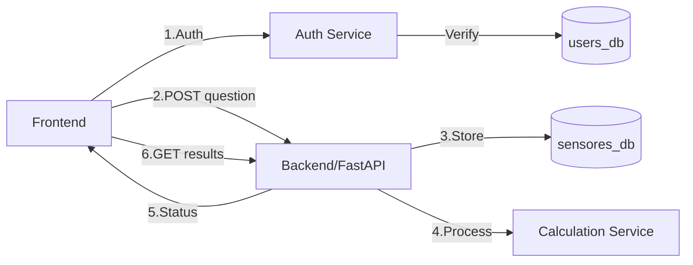

# Implementation Plan: Stress Monitoring API

## Architecture Overview



## Backend Structure

```
backend/
├── app/
│   ├── api/
│   │   ├── endpoints/
│   │   │   ├── auth.py
│   │   │   ├── questions.py
│   │   │   ├── sensors.py
│   │   │   └── results.py
│   ├── core/
│   │   ├── config.py
│   │   ├── security.py
│   │   └── calculations.py
│   ├── models/
│   │   ├── user.py
│   │   ├── sensor.py
│   │   └── question.py
│   ├── schemas/
│   │   ├── auth.py
│   │   ├── sensor.py
│   │   └── response.py
│   └── services/
│       ├── auth_service.py
│       ├── sensor_service.py
│       └── calculation_service.py
└── main.py
```

## Database Structure

### Existing Sensors Table
```sql
CREATE TABLE `sensores` (
  `id` int(11) NOT NULL AUTO_INCREMENT,
  `temperatura` float DEFAULT NULL,
  `ritmo_cardiaco` float DEFAULT NULL,
  `timestamp` timestamp NULL DEFAULT current_timestamp(),
  PRIMARY KEY (`id`)
);
```

### New Users Table
```sql
CREATE TABLE `users` (
  `id` int(11) NOT NULL AUTO_INCREMENT,
  `username` varchar(50) NOT NULL UNIQUE,
  `email` varchar(100) NOT NULL UNIQUE,
  `hashed_password` varchar(255) NOT NULL,
  `is_active` boolean DEFAULT true,
  `created_at` timestamp DEFAULT current_timestamp(),
  PRIMARY KEY (`id`)
);
```

## API Endpoints

### Authentication
```
POST /api/v1/auth/register
{
    "username": str,
    "email": str,
    "password": str
}

POST /api/v1/auth/login
{
    "username": str,
    "password": str
}
Response:
{
    "access_token": str,
    "token_type": "bearer"
}
```

### Sensors & Questions
```
POST /api/v1/sensors
{
    "temperatura": float,
    "ritmo_cardiaco": float
}

GET /api/v1/sensors/latest

POST /api/v1/questions
{
    "question_number": int,
    "answer_key": int  // 0-4 (nunca-siempre)
}
```

## Implementation Steps

1. Authentication Setup
   - Implement JWT authentication
   - User registration and login endpoints
   - Password hashing and verification

2. Database Integration
   - Connect to existing sensores_db
   - Set up users database
   - Implement database migrations

3. Core Services
   - Authentication service
   - Sensor data service
   - Calculation service implementation

4. API Security
   - JWT middleware
   - Rate limiting
   - Input validation

5. Frontend Integration
   - Authentication flow
   - Protected routes
   - Sensor data visualization

## Technical Considerations

### Security
- JWT token-based authentication
- Password hashing with bcrypt
- CORS configuration
- Rate limiting for API endpoints

### Error Handling
- Authentication errors
- Invalid sensor data
- Database connection issues
- Calculation errors

## Next Steps

1. Set up authentication system
2. Integrate with existing database
3. Implement sensor data endpoints
4. Add calculation services
5. Test API security
6. Frontend integration

## Database Strategy

### Current Database Setup
- Production Database: AWS RDS MariaDB instance
  - Host: stress-prueba1.cna4icyokmxm.us-east-2.rds.amazonaws.com
  - Database: sensores_db

### Development Database Strategy
1. Local Development:
   - Use Docker container with MariaDB
   - Maintain schema parity with production
   - Automated setup via docker-compose

2. Testing Environment:
   - Separate test database container
   - Automated cleanup between test runs
   - Mock data generation for testing

### Database Migration Strategy
1. Version Control:
   - Use Alembic for migration management
   - Track all schema changes in version control
   - Automated migration testing in CI/CD

2. Deployment Process:
   - Backup before migrations
   - Automated migration in deployment pipeline
   - Rollback procedures

### Existing Schema
```sql
CREATE TABLE `sensores` (
  `id` int(11) NOT NULL AUTO_INCREMENT,
  `temperatura` float DEFAULT NULL,
  `ritmo_cardiaco` float DEFAULT NULL,
  `timestamp` timestamp NULL DEFAULT current_timestamp(),
  PRIMARY KEY (`id`)
);

CREATE TABLE `users` (
  `id` int(11) NOT NULL AUTO_INCREMENT,
  `username` varchar(50) NOT NULL UNIQUE,
  `email` varchar(100) NOT NULL UNIQUE,
  `hashed_password` varchar(255) NOT NULL,
  `is_active` boolean DEFAULT true,
  `created_at` timestamp DEFAULT current_timestamp(),
  PRIMARY KEY (`id`)
);
```

### Data Management
1. Sensor Data:
   - Implement data retention policies
   - Regular archival of old data
   - Data aggregation for analytics

2. User Data:
   - GDPR compliance
   - Data encryption at rest
   - Access audit logging

### Backup Strategy
1. Production (AWS RDS):
   - Automated daily snapshots
   - Point-in-time recovery enabled
   - Cross-region backup replication

2. Development:
   - Local database dumps
   - Docker volume backups
   - Schema version tracking
